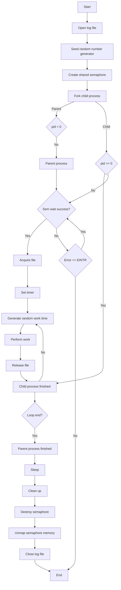

```mermaid
graph TD;
    A[Start] --> B[Open log file];
    B --> C[Seed random number generator];
    C --> D[Create shared semaphore];
    D --> E[Fork child process];
    E -->|Parent| F{pid < 0};
    E -->|Child| G{pid == 0};
    F -- No --> H[Parent process];
    H --> I{Sem wait success?};
    I -- Yes --> J[Acquire file];
    J --> K[Set timer];
    K --> L[Generate random work time];
    L --> M[Perform work];
    M --> N[Release file];
    N --> O[Cancel timer];
    O --> P{Loop end?};
    P -- Yes --> Q[Parent process finished];
    Q --> R[Sleep];
    R --> T[Clean up];
    T --> U[Destroy semaphore];
    U --> V[Unmap semaphore memory];
    V --> W[Close log file];
    W --> X[End];
    I -- No --> S{Error == EINTR};
    S -- Yes --> I;
    S -- No --> X;
    G -- Yes --> O[Child process finished];
    G -- No --> I;
    O -- No --> L;


```