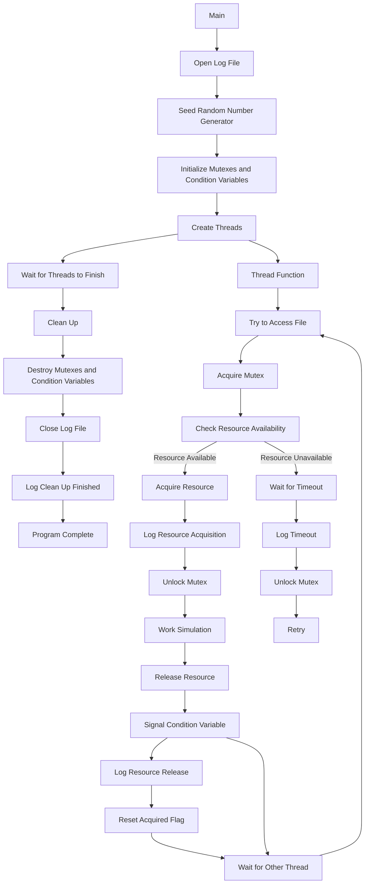

```mermaid
graph TD
    A[Main] --> B[Open Log File]
    B --> C[Seed Random Number Generator]
    C --> D[Initialize Mutexes and Condition Variables]
    D --> E[Create Threads]
    E --> F[Wait for Threads to Finish]
    F --> G[Clean Up]
    G --> H[Destroy Mutexes and Condition Variables]
    H --> I[Close Log File]
    I --> J[Log Clean Up Finished]
    J --> K[Program Complete]
    E --> L[Thread Function]
    L --> M[Try to Access File]
    M --> N[Acquire Mutex]
    N --> O[Check Resource Availability]
    O --> |Resource Available| P[Acquire Resource]
    P --> Q[Log Resource Acquisition]
    Q --> R[Unlock Mutex]
    R --> S[Work Simulation]
    S --> T[Release Resource]
    T --> U[Signal Condition Variable]
    U --> V[Log Resource Release]
    V --> W[Reset Acquired Flag]
    W --> X[Wait for Other Thread]
    O --> |Resource Unavailable| Y[Wait for Timeout]
    Y --> Z[Log Timeout]
    Z --> AA[Unlock Mutex]
    AA --> AB[Retry]
    U --> X[Wait for Other Thread]
    X --> M
```