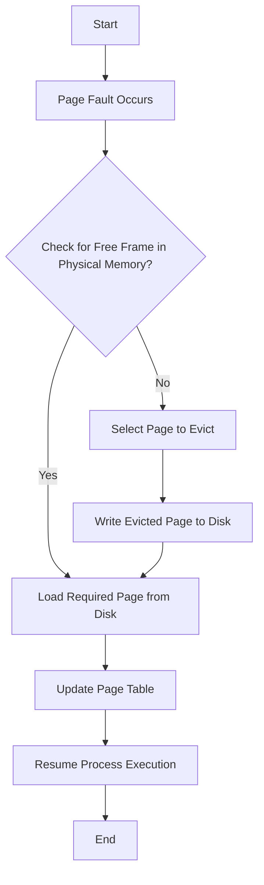

```mermaid
flowchart TD
    Start --> A[Page Fault Occurs]
    A --> B{Check for Free Frame in Physical Memory?}
    B -- Yes --> C[Load Required Page from Disk]
    B -- No --> D[Select Page to Evict]
    D --> E[Write Evicted Page to Disk]
    E --> C
    C --> F[Update Page Table]
    F --> G[Resume Process Execution]
    G --> End
```