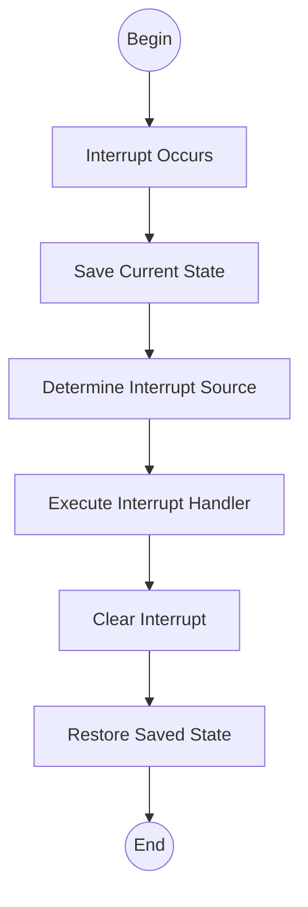

```mermaid
flowchart TD
    A((Begin)) --> B[Interrupt Occurs]
    B --> C[Save Current State]
    C --> D[Determine Interrupt Source]
    D --> E[Execute Interrupt Handler]
    E --> F[Clear Interrupt]
    F --> G[Restore Saved State]
    G --> H((End))

```