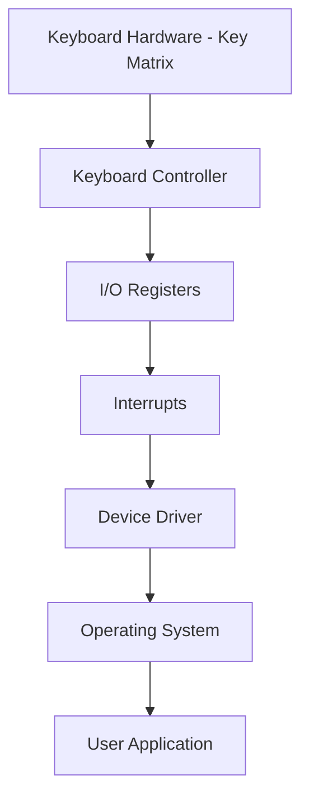

```mermaid
flowchart TD
    A[Keyboard Hardware - Key Matrix] --> B[Keyboard Controller]
    B --> C[I/O Registers]
    C --> D[Interrupts]
    D --> E[Device Driver]
    E --> F[Operating System]
    F --> G[User Application]

```