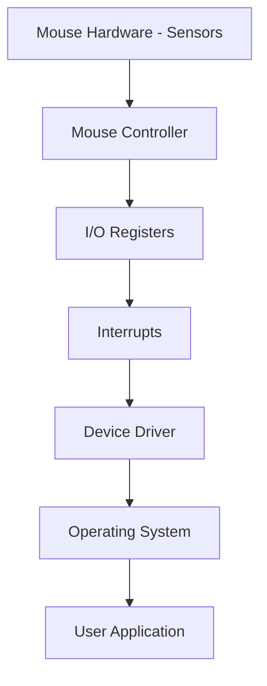

```mermaid
flowchart TD
    A[Mouse Hardware - Sensors] --> B[Mouse Controller]
    B --> C[I/O Registers]
    C --> D[Interrupts]
    D --> E[Device Driver]
    E --> F[Operating System]
    F --> G[User Application]
```